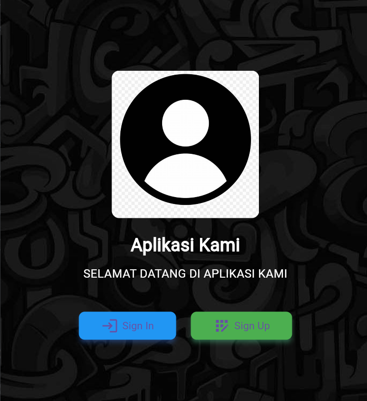
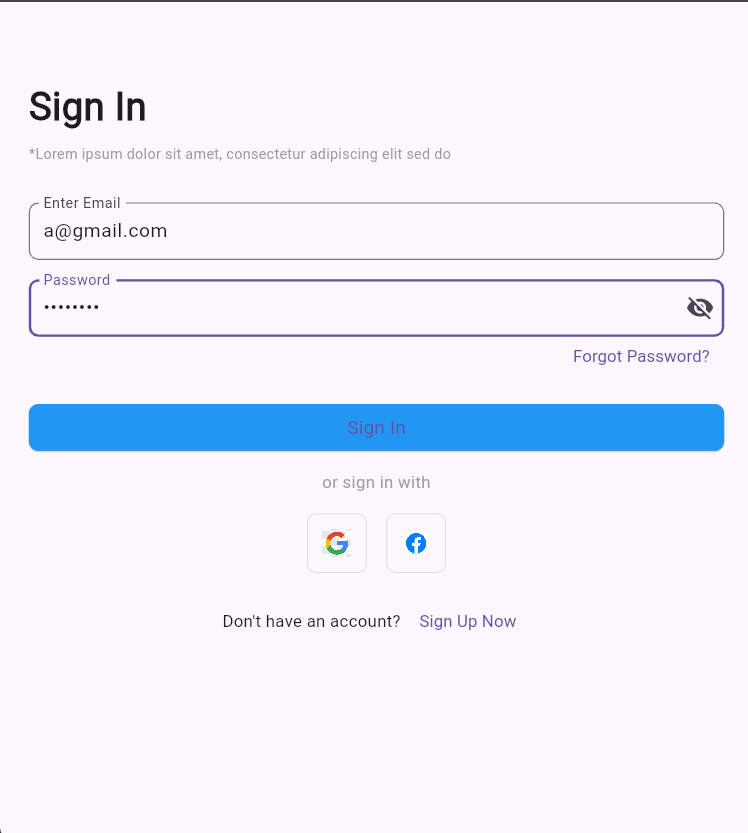
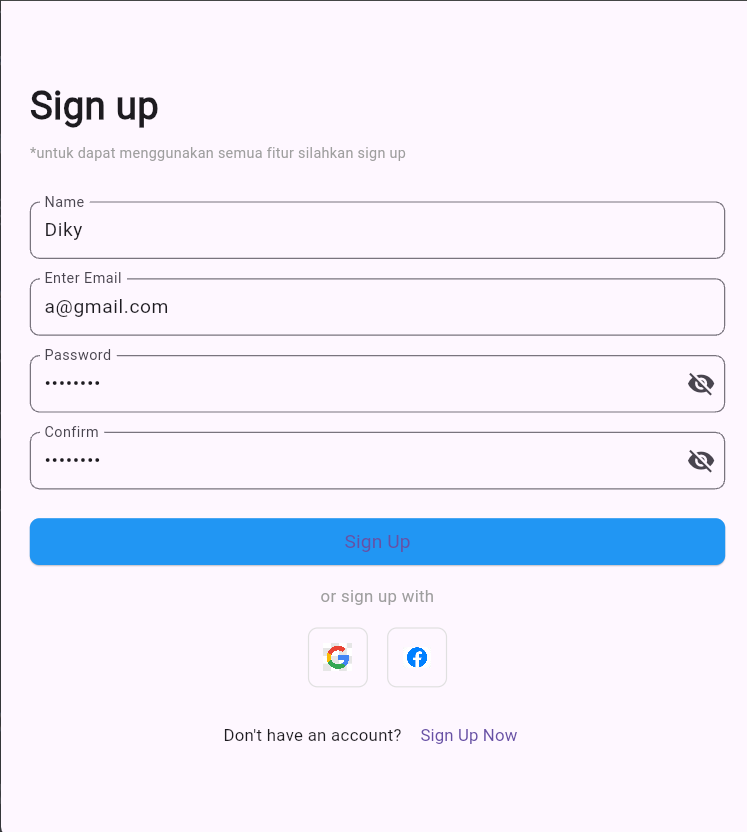
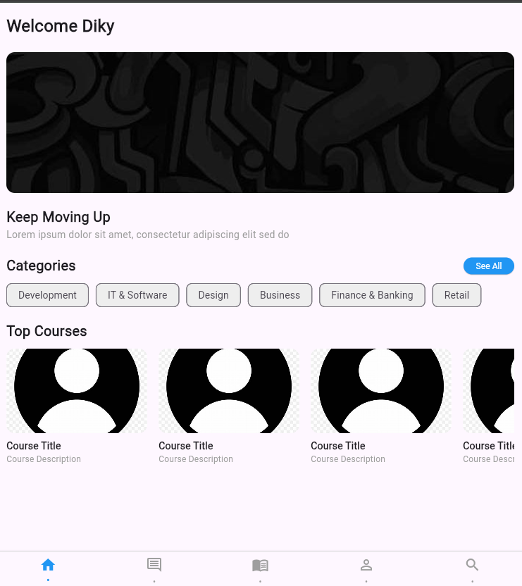
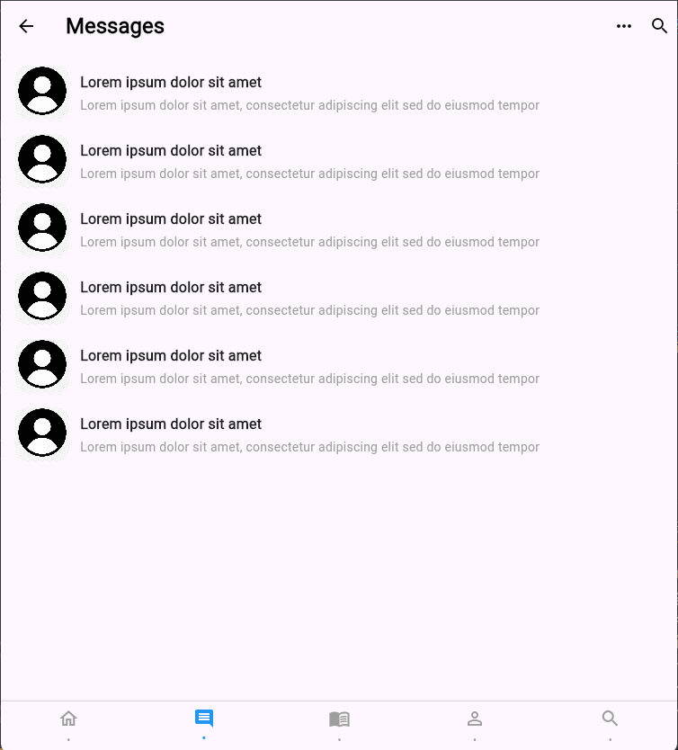
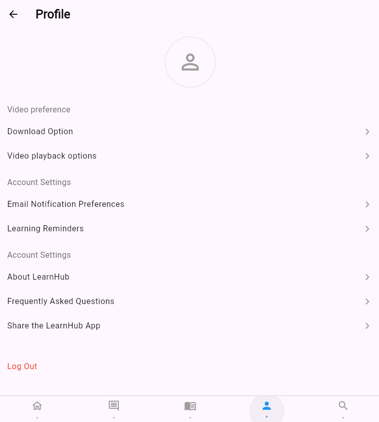
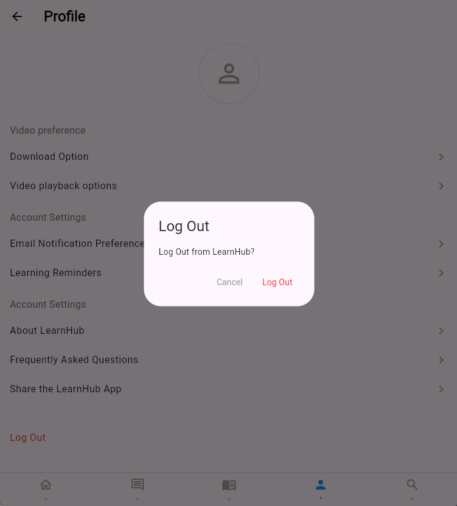

# template_project

1. Tampilan Home
,

 

2. Tampilan sign in
,

 

3. tampilan Signup
,

 

4. Tampilan Dashboard
,

 

5. Tampilan Message
,

 

6. Tampilan Profile
,

 

## Getting Started

This project is a starting point for a Flutter application.

A few resources to get you started if this is your first Flutter project:

- [Lab: Write your first Flutter app](https://docs.flutter.dev/get-started/codelab)
- [Cookbook: Useful Flutter samples](https://docs.flutter.dev/cookbook)

For help getting started with Flutter development, view the
[online documentation](https://docs.flutter.dev/), which offers tutorials,
samples, guidance on mobile development, and a full API reference.
